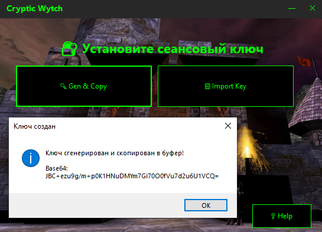
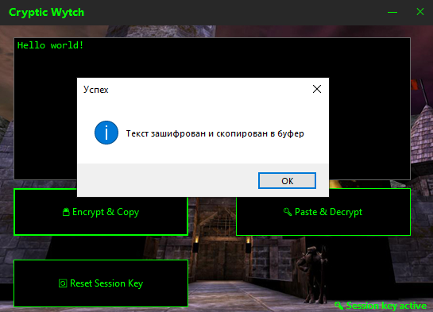

# Cryptic Wytch

**AES-256-GCM шифровальщик с сеансовыми ключами**


## ✨ Особенности

- 🔐 **Сеансовые ключи** — новый ключ для каждого сеанса
- 🛡️ **AES-256-GCM** — аутентифицированное шифрование
- 📋 **Буфер обмена** — всё работает через Ctrl+C / Ctrl+V
- 💾 **Переносимость** — Не требует установки
- 🌍 **Двуязычная инструкция** — русский / English

## 🚀 Быстрый старт

### Установка ключа

| Кнопка | Действие |
|--------|----------|
| `Gen && Copy` | Создать ключ → скопировать в буфер → войти в программу |
| `Import Key` | Вставить ключ из буфера → войти |

> ⚠️ **Внимание!** Ключ теряется после закрытия программы.  
> Сохраните его отдельно, если нужно расшифровать данные позже.

### Шифрование / Дешифровка

| Кнопка | Действие |
|--------|----------|
| `Encrypt && Copy` | Зашифровать текст → скопировать в буфер |
| `Paste && Decrypt` | Вставить из буфера → расшифровать |
| `Reset Session Key` | Сбросить ключ → вернуться к настройкам |

## 📸 Скриншоты

### Главное окно


### Режим шифрования


## 🛠️ Сборка из исходников

```bash
git clone https://github.com/DeadRabbit66/CrypticWytch.git
cd CrypticWytch
dotnet build -c Release
